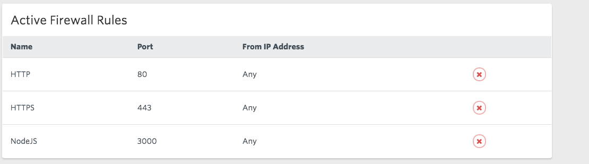
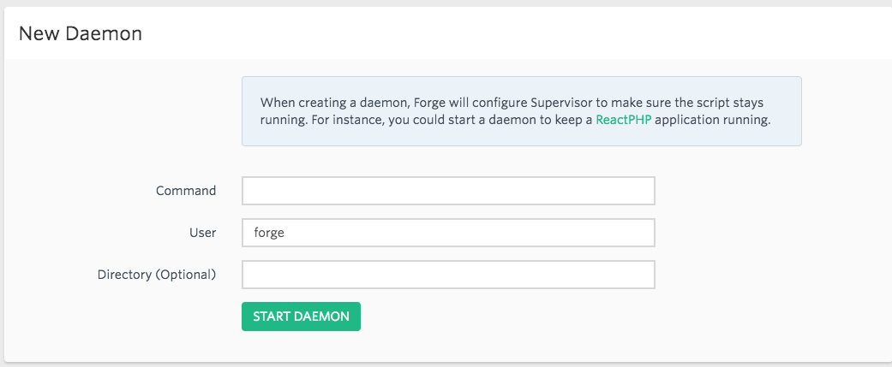

##Introduction

I am a huge fan of socket.io, and it turns out that my Laravel app needs real time functionality added to it. Socket.io runs in nodeJS, so I had to get it working with my Laravel app. I use Forge to host my laravel php server and node.js server side by side on the same EC2 instance. Here are the steps I took:  

### 1. Add socket.js node server to your project root
 
Let’s say our socket.js file in Laravel project root looks like this:
```javascript
var app = require('express')();
var http = require('http').Server(app);
var io = require('socket.io')(http);

var request = require('request');
var dotenv = require('dotenv').config();

var appurl = process.env.MAIN_APP_URL;

app.get('/', function(req, res){
  res.send(appurl);
});

io.on('connection', function (socket)
{
    console.log('a user connected');
    socket.on('disconnect', function ()
    {
        console.log('user disconnected');
    });
});

http.listen(3000, function ()
{
    console.log('listening on *:3000');
});
```
 
Once you add the file, just push to git, deploy to forge, so this file is inside your project root.


### 2. Setting up Node on AWS
 
* SSH into AWS (replace IP address with your server IP)
`ssh forge@11.22.333.444`
 
* Follow this guide to install node on your server. http://docs.aws.amazon.com/sdk-for-javascript/v2/developer-guide/setting-up-node-on-ec2-instance.html
```
curl -o- https://raw.githubusercontent.com/creationix/nvm/v0.32.0/install.sh | bash
. ~/.nvm/nvm.sh
nvm install 4.4.5
node -e "console.log('Running Node.js ' + process.version)”
```

* By now, if you run `node socket.js` (or whatever your node file is), it should run the node server, and should say `listening on *:3000`
Go to your site directory (`cd YOURSITE.COM`) and run install your required npm packages with npm install
 
However, when you try to connect to your server by ip:port like `11.22.333.444:3000`, it still gives timeout error. 


 
### 3. Set up Security Groups on AWS
First step is modifying your AWS security group for your EC2 instance to allow inbound for port 3000.
 
* Log in to AWS console https://console.aws.amazon.com
* Go to EC2, select your instance, and find security groups for your instance. * Click on it to edit.
* Select security group-> actions->edit inbound rules. 
* Add Custom TCP with port 3000 (or whatever your node uses)
 

### 4. Setting up Firewall Rules on Forge
It will still give timeout error when you connect via the ip address. and it is because the Firewall rules aren’t set up yet.
Go to forge, and servers -> network -> new firewall rule.
For name: Say anything, like NodeJS
For port: specify your node port number, in my case 3000
 
 
Now, check if everything works by going to your IP:port in your browser like this: 
`11.22.333.444:3000`
 
If it shows your node app running, everything is ready and set up!



### 5. Creating Daemon on Forge
Last step of the process is creating Daemon so you don't have to SSH and run node socket.js on your terminal. Type ctrl+c on terminal to exit node process.

Go to Forge-> Server->Daemons
For command type `node socket.js`
For directory, type in the directory your node app is hosted on.


